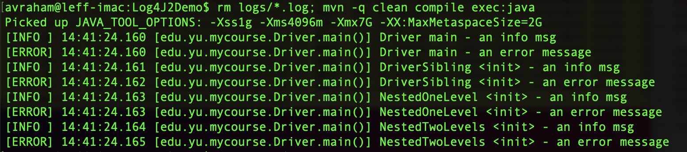
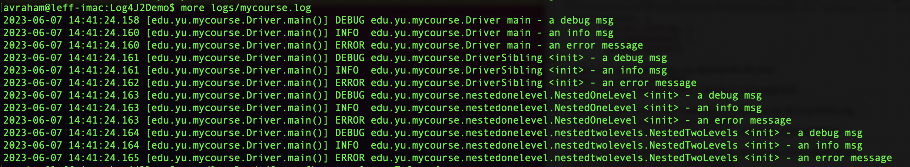

# Log4J2Demo

I'm not going to motivate the importance of using a logging framework: if you aren't already convinced, just trust me :-).

Many, many logging frameworks exist: the important principles are

* Don't write your own, even if you really, really want to ...
* (Almost always), the specific features don't matter: pick one and become sufficiently comfortable with it that you don't have to think about how to use it.

The pom file that I use to compile and test your code must contain a fixed set of dependencies.  In general, you're restricted to using the JDK, JUnit, and [log4j2](https://logging.apache.org/log4j/2.x/maven-artifacts.html) libraries.  This implies that the only way for you to get log output as I execute your code is for you to also use the log4j2 framework.   The framework is very sophisticated, and **(in my opinion only)** unnecessarily complicated for the basic *run your code for five minutes (max)* scenarios.  To encourage you to use log4j2 I'm going to specify a basic usage approach for log4j2.  

The purpose of this Git repository is:

* To give you a small, self-contained, set of code so you can easily modify/experiment with to see how the logging framework behaves
* To give you a `log4j2.properties` file that (IMHO) supports the basic testing scenarios.

## Scope 

See the Java classes and `pom file` in this repository: 

* Only two imports are needed to get basic functionality
* Each class creates a static variable that points to the logger for that class
* The top-level `Driver` class (invoked by main) emits a set of logger statements in `main`; the other classes emit corresponding logger statements in their constructor.
* Only two `log4j2` dependencies in the `pom file`.

## Log Levels

The log4j2 library provides the `ALL, TRACE, DEBUG, INFO, WARN, ERROR, FATAL, and OFF` levels.  My examples will use only `DEBUG, INFO, ERROR, and OFF`.  Be sure to understand the implications of the "hierarchy of levels".

## Configuration

I use a properties file (`src/main/resources/log4j2.properties`) to configure log4j2, rather than e.g., XML or or JSON.

### Goal

The basic "first order" decision is: *what log output do I want to persist to a file?* versus *what log output do I want to see on the console?*

In production, a good case can be made that we want to persist **less** log output to a file (compared to console) because we don't want to exhaust disk storage.  (Note that there are ways to address this issue, and that in general, too much information about the state of your system is **not** a problem :-)).  In this scenario, we want to specify that only "high importance" messages get logged to disk, relative to the console.

However: for the development & testing scenarios we're interested in, I think that the opposite is the case.  Here you want as much information as possible logged persistently, so that you can pore over/post-process the log file to understand what went awry.  We only use the console information to see, at a high level, whether things are working correctly or not.

From this perspective, the following property file specification `log4j2.properties.minimal` (remember to copy as `log4j2.properties`) is sufficient.

> status = error
dest = err
name = PropertiesConfig
# 
property.filename = logs
# 
appender.console.type = Console
appender.console.name = STDOUT
appender.console.layout.type = PatternLayout
appender.console.layout.pattern = [%-5level] %d{yyyy-MM-dd HH:mm:ss.SSS} [%t] %c{1} %method - %msg%n
appender.console.filter.threshold.type = ThresholdFilter
appender.console.filter.threshold.level = info
# 
appender.file.type = File
appender.file.name = LOGFILE
appender.file.fileName=${filename}/mycourse.log
appender.file.layout.type=PatternLayout
appender.file.layout.pattern=%d{HH:mm:ss.SSS} [%t] %-5level %logger{36} %method - %msg%n
appender.file.filter.threshold.type = ThresholdFilter
appender.file.filter.threshold.level = debug
#
logger.file.name = edu.yu.mycourse
# 
rootLogger = debug, STDOUT, LOGFILE

As shown below, all messages at level INFO (and above) are logged to the console; all messages at level DEBUG (and above) are logged to disk.  This behavior is specified using the `threshold.type` and `threshold.level` values.

### Output Logged To Console

### Output Logged To Disk

